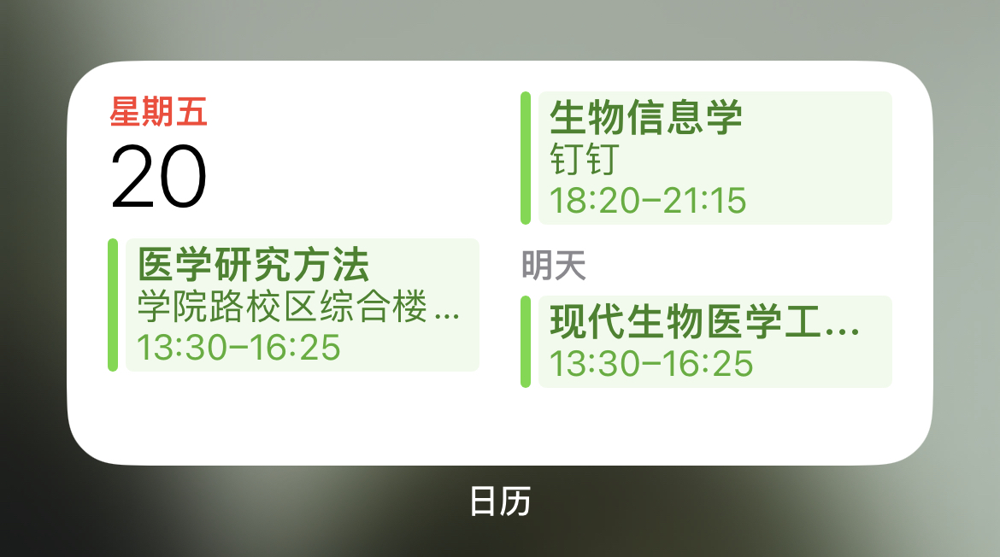
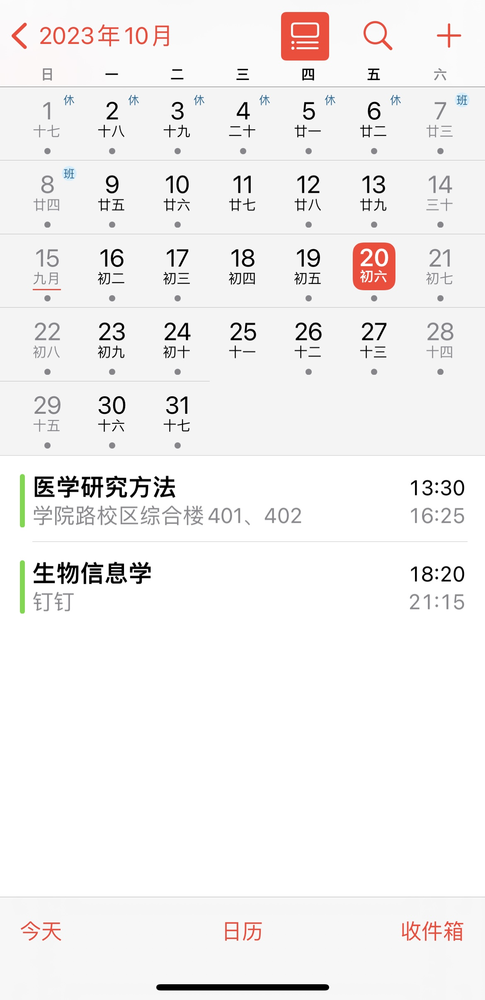

# 温州医科大学课程表导入日历

## 步骤
- 浏览器登录温医大打开课表
- 浏览器开发者模式，查看这个页面的cookie
- cookie形如`JSESSIONID=B8373CF0D292312CCE0D07D8F13D495F`
- 修改`kebiao.py`里面的cookie
- 使用python运行这个脚本
- 等待片刻，即可获取自己课表的ics文件，名称为`kb_学号.ics`
- 去百度上面查找如何导入ics进入手机日历，或者把ics文件发给

## 最后的效果

